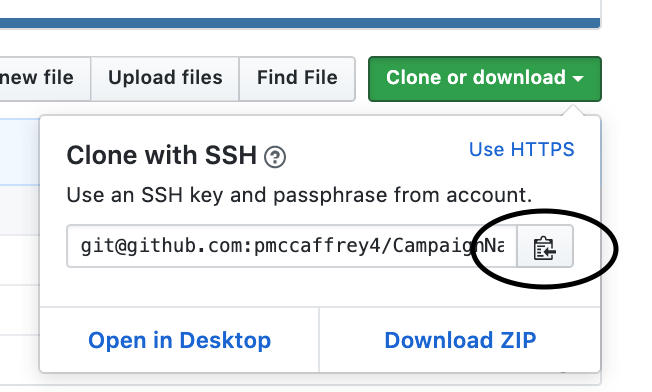

# CampaignNamingQA

[CampaignNamingQA Github Link](https://github.com/pmccaffrey4/CampaignNamingQA)

## Step 1:

### Clone Git Repo to your computer


#### 1. Copy Link by selecting Copy button circled in the below photo.




#### 2. Open your Terminal or Command Prompt Windows, navigate where you would like this project to live.

I saved this on my Desktop, to get there through command line.
	
**Linux/Mac:**
```cd ~/Desktop/```
	
**Windows:**
```cd Desktop```

#### 3. Clone the repo to your Desktop.

```git clone "link copied from above"```


## For Windows you need to download the git manually:
[Window git download](https://git-scm.com/download/win)
